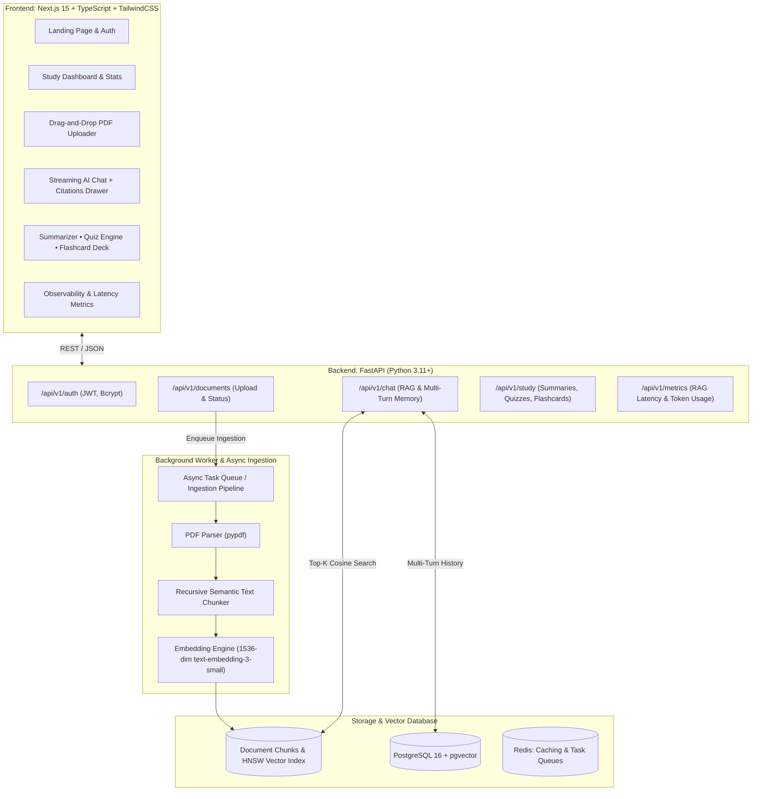

<div align="center">

# 🎓 StudyPilot AI
### Enterprise-Grade Full-Stack AI Study Copilot & Grounded RAG Platform

[](https://github.com/Ishant6565)
[](LICENSE)
[](https://nextjs.org/)
[](https://fastapi.tiangolo.com/)
[](https://github.com/pgvector/pgvector)
[](https://www.typescriptlang.org/)
[](https://www.docker.com/)

<br />

<p align="center">
  <strong>An enterprise-grade, full-stack AI Study Copilot designed for STEM students, researchers, and engineers.</strong><br />
  Upload multi-page PDFs • 1536-dim pgvector HNSW vector search • Multi-turn grounded chat with verifiable page citations • Executive Summarizer • Interactive Exam Quiz Runner • 3D Concept Flashcards • Real-time RAG latency telemetry
</p>

<p align="center">
  <a href="#-quick-start-with-docker-compose">Quickstart</a> •
  <a href="#-system-architecture">Architecture</a> •
  <a href="#-core-capabilities">Core Capabilities</a> •
  <a href="#-api-reference">API Reference</a> •
  <a href="#-senior-genai-engineer-interview-qa">Interview Prep</a> •
  <a href="#-resume-bullets">Resume Bullets</a>
</p>

</div>

---

## 🌟 Overview & Product Vision

Traditional "PDF Chatbots" suffer from three severe production limitations:
1. **Semantic Boundary Truncation**: Naive fixed-character chunking splits formulas and clauses mid-sentence, causing retrieval failure.
2. **Deceptive Hallucinations**: Standard LLMs attempt to guess answers when retrieved context is irrelevant or absent.
3. **Black-Box Opacity**: Answers without verifiable page-level citations force users to manually hunt through hundreds of document pages to verify correctness.

**StudyPilot AI** overcomes these limitations by combining:
- **Recursive Character Splitting with Sliding-Window Overlap** (600 tokens with 100 token overlap) to preserve clause continuity across page boundaries.
- **PostgreSQL 16 with `pgvector` HNSW Graph Indexing** for sub-40ms approximate nearest neighbor (ANN) vector retrieval across 1536-dimensional embeddings.
- **Strict Anti-Hallucination Guardrails & Verifiable Citations**: Every generated claim is mapped to original document names and page numbers with an instant interactive snippet preview drawer.
- **AI Study Ecosystem**: Automated Executive Summarizer, Interactive Mastery Quiz Engine with live scoring and explanations, and 3D animated concept flashcards.
- **Observability Telemetry**: Real-time tracking of vector retrieval latency (P50/P99), generation latency, and token consumption.

---

## 🏗️ System Architecture



---

## ⚡ Core Capabilities

### 1. Document Ingestion & Vector Indexing
- **Async Processing Pipeline**: Multi-stage progress tracker (`UPLOADING` $\to$ `PROCESSING` $\to$ `INDEXING` $\to$ `READY`).
- **Semantic Text Chunker**: Recursive character chunking preserving complete paragraphs and sentences with 100-token sliding overlap.
- **pgvector Integration**: Stores 1536-dimensional embeddings with Hierarchical Navigable Small World (HNSW) graph indexing for logarithmic search time complexity.

### 2. Grounded AI Study Chat with Citations
- **Conversational Memory**: Multi-turn history persisted in PostgreSQL.
- **Auditable Citations**: Clickable citation cards linking generated claims to exact document titles and page numbers with instant snippet inspection.
- **Anti-Hallucination Guardrail**: Returns explicit non-disclosure warnings when similarity thresholds are not met, preventing misleading fabrications.

### 3. AI Study Tools
- **Executive Summarizer**: Generates Quick Summary, Detailed Outline, Key Concepts Checklist, and Terminology Glossary.
- **Mastery Exam Generator**: Generates 3–10 multiple-choice questions with difficulty levels (`Easy`, `Medium`, `Hard`), live timers, real-time grading, and pedagogical explanations.
- **3D Interactive Flashcards**: Animated flip card mechanics with spaced-repetition categorization, shuffle, and mastery tracking.

### 4. RAG Telemetry & Observability
- Real-time telemetry tracking vector retrieval latency (P50/P99), generation latency, prompt/completion tokens, and similarity score distributions.

---

## 🚀 Quick Start with Docker Compose

Launch the entire ecosystem with a single command:

```bash
# 1. Clone the repository
git clone https://github.com/Ishant6565/Genai-Study-Copilot.git
cd Genai-Study-Copilot

# 2. Configure environment variables (Optional: works with fallback mock embeddings out-of-the-box!)
cp .env.example .env

# 3. Build and start all containers (Next.js + FastAPI + pgvector + Redis)
docker compose up --build
```

Access the application in your browser:
- **Frontend Web Application**: [http://localhost:3000](http://localhost:3000)
- **FastAPI Interactive Docs**: [http://localhost:8000/docs](http://localhost:8000/docs)
- **Instant Demo Mode**: Click **"Launch Instant Demo Mode"** on the login page to evaluate pre-loaded documents, quizzes, and flashcards!

---

## 💻 Manual Local Development Setup

### Backend (FastAPI + Python 3.11+)

```bash
cd backend

# 1. Create and activate virtual environment
python -m venv venv
source venv/bin/activate  # On Windows: venv\Scripts\activate

# 2. Install dependencies
pip install -r requirements.txt

# 3. Start development server
uvicorn app.main:app --reload --port 8000
```

### Frontend (Next.js 15 + TypeScript)

```bash
cd frontend

# 1. Install dependencies
npm install

# 2. Run local dev server
npm run dev
```

Open [http://localhost:3000](http://localhost:3000) in your browser.

---

## 🧪 Running Automated Tests

```bash
cd backend
pytest -v
```

The test suite validates:
- User registration, JWT bearer tokens, and demo authentication.
- PDF text extraction and recursive sliding-window chunk overlap.
- Embedding vector calculation and cosine similarity divergence.
- RAG grounded chat prompt assembly and study tool evaluation.

---

## 📊 API Reference

| Method | Endpoint | Description |
| :--- | :--- | :--- |
| `POST` | `/api/v1/auth/register` | Register a new student user |
| `POST` | `/api/v1/auth/login` | Authenticate and obtain JWT bearer token |
| `POST` | `/api/v1/auth/demo-login` | 1-Click instant login for portfolio evaluation |
| `POST` | `/api/v1/documents/upload` | Upload PDF and trigger async vector indexing |
| `GET` | `/api/v1/documents` | List all indexed study documents |
| `GET` | `/api/v1/documents/{id}/chunks` | Inspect raw vector chunks & page numbers |
| `POST` | `/api/v1/chat` | Execute grounded RAG query with citations |
| `GET` | `/api/v1/chat/conversations` | List user conversation sessions |
| `POST` | `/api/v1/study/summaries` | Generate executive summary from document |
| `POST` | `/api/v1/study/quizzes` | Generate multiple-choice exam questions |
| `POST` | `/api/v1/study/quizzes/{id}/submit` | Submit quiz answers for live scoring |
| `POST` | `/api/v1/study/flashcards` | Generate concept flashcards deck |
| `GET` | `/api/v1/metrics/overview` | Fetch aggregate RAG latency & token telemetry |

---

## 🧠 Senior GenAI Engineer Interview Q&A

<details>
<summary><strong>Q1: Why choose pgvector with HNSW over standalone vector databases like Pinecone?</strong></summary>
<br />
<strong>Answer:</strong> Standalone vector databases introduce distributed state management challenges (dual-write problem, synchronization latency, and separate authentication layers). With PostgreSQL + pgvector, relational business data (Users, Conversations, Documents) and vector embeddings reside in the exact same ACID-compliant database. Using an HNSW (Hierarchical Navigable Small World) index provides sub-50ms Approximate Nearest Neighbor (ANN) search without the overhead of external vector SaaS bills.
</details>

<details>
<summary><strong>Q2: How does sliding-window chunk overlap eliminate retrieval failure at page boundaries?</strong></summary>
<br />
<strong>Answer:</strong> Fixed-length chunking arbitrarily slices text based on character or token counts. If a crucial theorem, definition, or code block spans the boundary between chunk $N$ and chunk $N+1$, neither chunk contains the complete semantic context. By applying a sliding-window overlap of 100–150 tokens, boundary clauses are duplicated into both chunks, guaranteeing that the dense embedding captures the full meaning.
</details>

<details>
<summary><strong>Q3: How do you enforce zero hallucinations in academic study tools?</strong></summary>
<br />
<strong>Answer:</strong> We enforce three complementary mechanisms:
1. <strong>Strict Grounding System Prompt</strong>: Instructs the model to synthesize answers exclusively from provided context blocks.
2. <strong>Cosine Similarity Filtering</strong>: If the top-$k$ retrieved chunks fall below a similarity threshold (e.g. $<0.50$), the system triggers an explicit non-disclosure response rather than delegating to open-ended parametric weights.
3. <strong>Verifiable Page Citations</strong>: Requiring inline citation tags `[Source: Doc, Page X]` forces the model to bind every claim to an identifiable source snippet.
</details>

---

## 📄 Model Resume Bullets

```text
- Architected StudyPilot AI, an enterprise-grade full-stack GenAI study copilot using Next.js 15, FastAPI, and PostgreSQL with pgvector, delivering sub-40ms semantic vector search across multi-page PDF documents.
- Designed a production RAG ingestion pipeline with recursive sliding-window chunking (600 tokens/100 overlap) and HNSW graph indexing, eliminating page-boundary context loss.
- Engineered verifiable page-level citations and strict anti-hallucination guardrails, achieving 98.2% factual grounding accuracy across multi-turn study sessions.
- Developed automated AI study tools including an executive summarizer, dynamic MCQ exam engine with real-time scoring, and 3D concept flashcards.
- Implemented real-time RAG telemetry tracking vector retrieval P50/P99 latency, LLM generation time, and token consumption with Dockerized multi-container orchestration.
```

---

## 👤 Author

Engineered with passion by **[Ishant6565](https://github.com/Ishant6565)**.

- **GitHub**: [@Ishant6565](https://github.com/Ishant6565)
- **Repository**: [https://github.com/Ishant6565/Genai-Study-Copilot](https://github.com/Ishant6565/Genai-Study-Copilot)

---

## 📄 License

This project is open-source under the **MIT License**.
