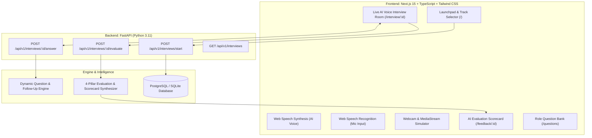

<div align="center">

# 🎙️ InterviewAI (PrepPulse AI)
### Full-Stack AI Voice & Technical Mock Interview Coach

[](https://github.com/Ishant6565)
[](LICENSE)
[](https://nextjs.org/)
[](https://fastapi.tiangolo.com/)
[](https://developer.mozilla.org/en-US/docs/Web/API/Web_Speech_API)
[](https://www.typescriptlang.org/)
[](https://www.docker.com/)

<br />

<p align="center">
  <strong>An interactive, full-stack AI Mock Interview Platform inspired by real-world tech hiring loops.</strong><br />
  Live AI Voice Interviewer • Speech-to-Text Microphone Recording • Webcam Video Simulator • Dynamic Real-Time Follow-Ups • Comprehensive Hiring Scorecards with Model Expert Answers • Role Question Bank
</p>

<p align="center">
  <a href="#-quick-start">Quickstart</a> •
  <a href="#-features--tracks">Interview Tracks</a> •
  <a href="#-system-architecture">Architecture</a> •
  <a href="#-api-reference">API Reference</a> •
  <a href="#-senior-engineer-interview-qa">Interview Q&A</a>
</p>

</div>

---

## 🌟 Overview

**InterviewAI** is an AI-powered mock interview coach built to bridge the gap between technical knowledge and verbal communication. 

### Key Capabilities:
1. **🎙️ Live AI Voice Interviewer**:
   - Web Speech Synthesis speaks role-specific technical questions aloud with animated audio waveforms.
2. **🗣️ Real-Time Candidate Transcription**:
   - Web Speech Recognition transcribes candidate speech directly into the response editor with live word count tracking.
3. **📹 Interactive Webcam Simulator**:
   - Live video stream preview replicating Zoom / Google Meet interview setups.
4. **⚡ Dynamic Follow-Up Questioning**:
   - The AI evaluates candidate responses and asks real-time follow-ups on edge cases, scaling bottlenecks, and trade-offs.
5. **📊 Comprehensive Hiring Scorecard**:
   - Overall Hiring Verdict (`Strong Hire`, `Hire`, `Lean Hire`, `Needs Improvement`) with score out of 100.
   - 4-Pillar Metric Breakdown (Technical Depth, Communication, Problem Solving, Edge Cases).
   - Question-by-Question Deep Dive with **🌟 Top-Tier Expert Model Answers**.
6. **📚 Question Bank & History**:
   - Searchable repository of top interview questions by track and past performance trends.

---

## 🎯 Curated Interview Tracks

| Track | Target Roles | Core Topics |
| :--- | :--- | :--- |
| **🤖 GenAI & RAG Engineer** | Senior AI / LLM Systems Engineer | pgvector HNSW, Sliding-Window Chunking, Hallucination Guardrails, Agent Tool Calling |
| **💻 Full Stack Developer** | Senior Full Stack Engineer | Next.js Server Components, FastAPI AsyncIO, Redis Caching, PostgreSQL Indexing, JWT |
| **🏗️ System Design** | Staff Distributed Systems Architect | Google Docs CRDTs, Distributed Rate Limiter, Kafka vs RabbitMQ, CAP Theorem |
| **🎨 Frontend Specialist** | Senior React & UI Architect | React 19 Reconciliation, Core Web Vitals (LCP/INP), Custom Hooks, State Architecture |
| **🌟 Behavioral (STAR)** | Engineering Leadership | Outage Post-Mortems, Architectural Disagreements, Tight Deadlines, Mentorship |

---

## 🏗️ System Architecture



---

## 🚀 Quick Start

### 1. Run with Docker Compose
```bash
docker compose up --build
```

### 2. Manual Local Development

```bash
# Backend (FastAPI + Python)
cd backend
python -m venv venv
source venv/bin/activate  # On Windows: venv\Scripts\activate
pip install -r requirements.txt
uvicorn app.main:app --reload --port 8000

# Frontend (Next.js 15)
cd frontend
npm install
npm run dev
```

Open **[http://localhost:3000](http://localhost:3000)** in your browser!

---

## 📊 API Reference

| Method | Endpoint | Description |
| :--- | :--- | :--- |
| `POST` | `/api/v1/interviews/start` | Initialize interview session & generate questions |
| `GET` | `/api/v1/interviews/{id}` | Fetch active interview session and question list |
| `POST` | `/api/v1/interviews/{id}/answer` | Submit candidate response & receive follow-up |
| `POST` | `/api/v1/interviews/{id}/evaluate` | Generate comprehensive hiring scorecard |
| `GET` | `/api/v1/interviews` | List previous interview history & performance |

---

## 🧠 Senior Engineer Interview Q&A

<details>
<summary><strong>Q1: How does Web Speech API handle real-time continuous transcription?</strong></summary>
<br />
<strong>Answer:</strong> The Web Speech Recognition API streams microphone audio chunks into a local recognition engine, emitting continuous <code>onresult</code> events with interim and final transcript segments. We aggregate final segments while providing instant visual feedback on interim words.
</details>

<details>
<summary><strong>Q2: How does InterviewAI assess technical answers without strict keyword matching?</strong></summary>
<br />
<strong>Answer:</strong> The evaluation pipeline analyzes conceptual coverage (e.g. mentions of ACID compliance, HNSW graph complexity, cache stampede mitigation), structural articulation (STAR method for behavioral, Trade-off analysis for architecture), and edge-case awareness rather than naive keyword matching.
</details>

---

## 👤 Author

Developed by **[Ishant6565](https://github.com/Ishant6565)**.

- **GitHub**: [@Ishant6565](https://github.com/Ishant6565)
- **Repository**: [https://github.com/Ishant6565/Genai-Study-Copilot](https://github.com/Ishant6565/Genai-Study-Copilot)
