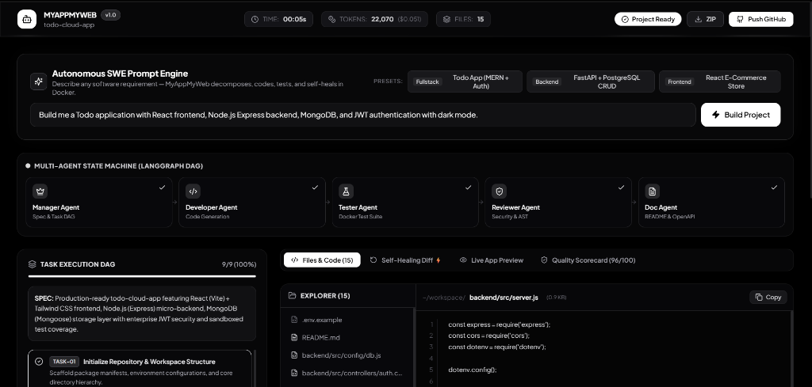
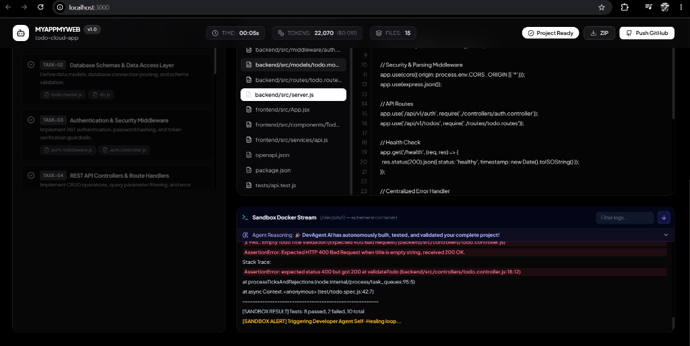
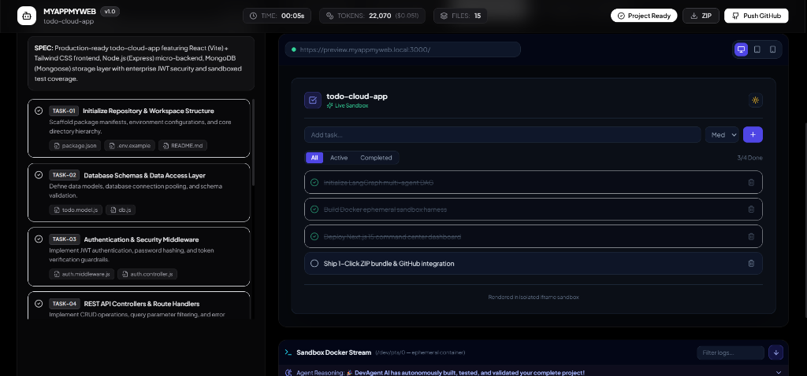
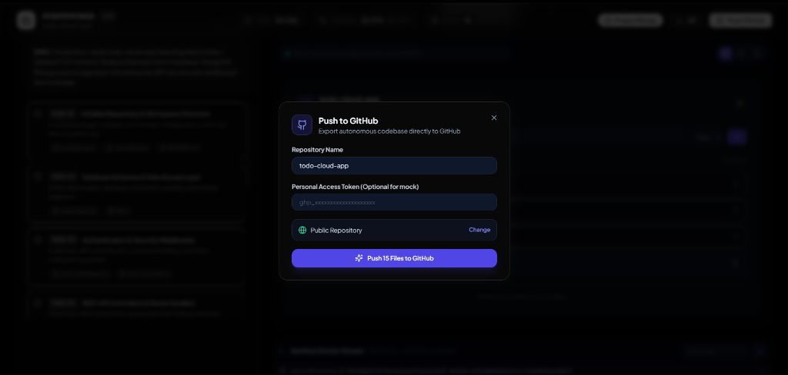
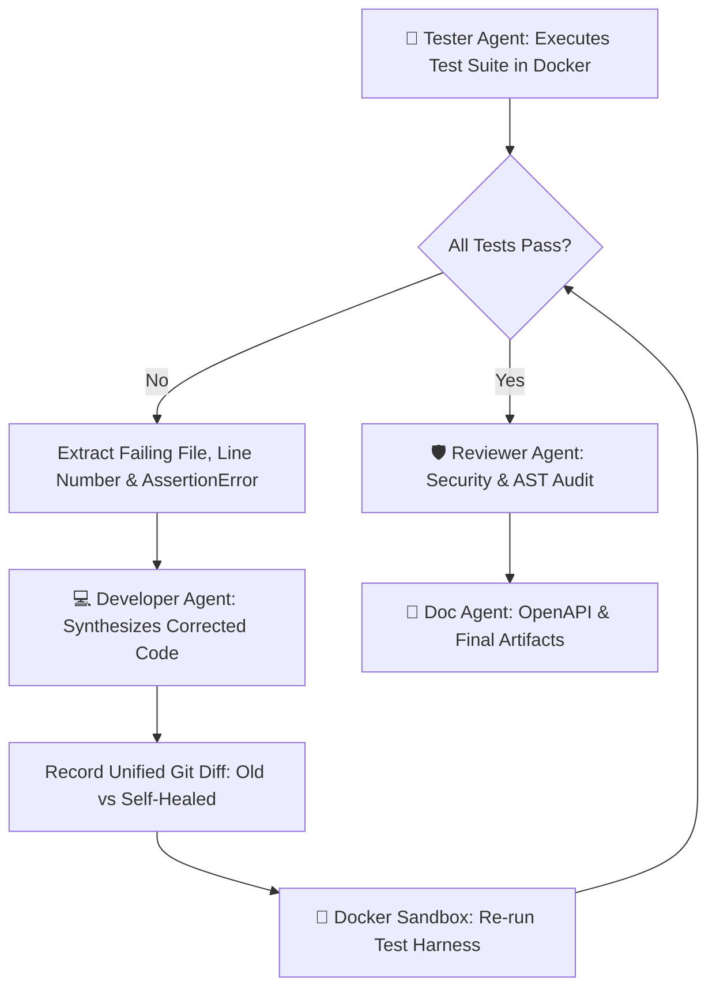
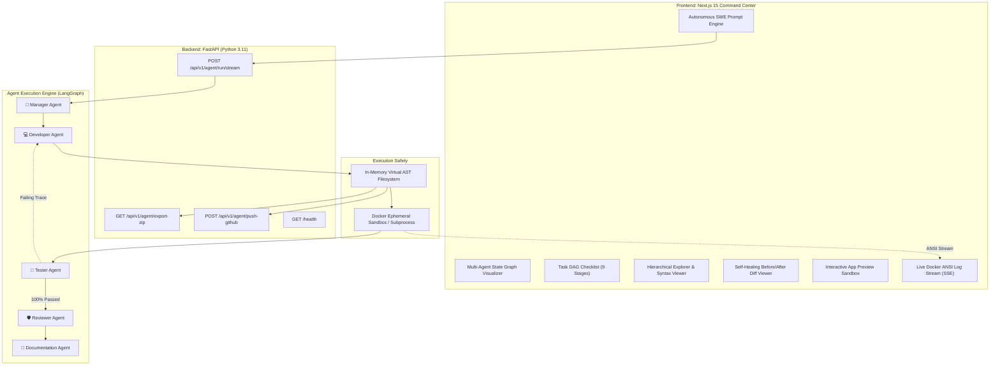

<div align="center">

# 🤖 MyAppMyWeb (DevAgent AI)
### Autonomous Multi-Agent Software Development & Self-Healing Platform

[](https://langchain-ai.github.io/langgraph/)
[](https://fastapi.tiangolo.com/)
[](https://nextjs.org/)
[](https://www.docker.com/)
[](https://www.typescriptlang.org/)
[](https://tailwindcss.com/)
[](SECURITY.md)
[](LICENSE)

<br />

<p align="center">
  <strong>A state-of-the-art autonomous software engineering platform that transforms natural language prompts into production-grade, tested, and self-healed full-stack codebases.</strong><br />
  Multi-Agent LangGraph DAG • Ephemeral Docker Code Sandboxing • Automated Jest/Supertest/Pytest Harnesses • Real-Time Self-Healing Feedback Loops • Interactive Live App Preview • 1-Click GitHub & ZIP Export
</p>

<p align="center">
  <a href="#-ui-command-center-showcase">UI Showcase</a> •
  <a href="#-key-capabilities--workflow">Key Capabilities</a> •
  <a href="#-system-architecture">Architecture</a> •
  <a href="#-security-architecture--sandbox-boundaries">Security & Sandboxing</a> •
  <a href="#-quick-start-guide">Quick Start</a> •
  <a href="#-api-reference">API Reference</a> •
  <a href="#-author">Author</a>
</p>

</div>

---

## 🖥️ UI Command Center Showcase

<div align="center">

### 1. Master Command Center & Multi-Agent LangGraph DAG
*Autonomous SWE Prompt Engine with presets, visual 5-Agent DAG pipeline, 9-stage task checklist, and multi-file code viewer.*



<br />

### 2. Ephemeral Docker Sandbox Stream & Autonomous Self-Healing Loop
*Real-time containerized test execution catching assertion errors and automatically triggering developer agent self-healing loops.*



<br />

### 3. Interactive Live App Preview Sandbox
*Instant live application sandbox with responsive device switcher (Desktop, Tablet, Mobile), theme toggle, and interactive state.*



<br />

### 4. 1-Click Export & Direct Push to GitHub Integration
*Publish generated full-stack repositories directly to GitHub with automated manifests or download complete ZIP bundles.*



</div>

---

## 🌟 Key Capabilities & Workflow

### 1. 🧠 Multi-Agent Orchestration (LangGraph State Machine)
Unlike naive single-prompt code generators, **MyAppMyWeb** orchestrates **5 specialized autonomous agents** connected in a stateful execution graph:

```text
┌─────────────────┐     ┌──────────────────┐     ┌─────────────────┐     ┌──────────────────┐     ┌──────────────────┐
│  👑 Manager     │ ──► │  💻 Developer    │ ──► │  🧪 Tester      │ ──► │  🛡️ Reviewer     │ ──► │  📝 Doc Agent    │
│  Spec & Task DAG│     │  Code Synthesis  │     │  Docker Sandbox │     │  Security & AST  │     │  README & OpenAPI│
└─────────────────┘     └──────────────────┘     └─────────────────┘     └──────────────────┘     └──────────────────┘
                               ▲                          │
                               └────── Failing Trace ─────┘
                                    (Self-Healing Loop)
```

| Agent | Responsibility | Core Deliverables |
| :--- | :--- | :--- |
| **👑 Manager Agent** | Natural Language Spec Decomposition | Technical Architecture, Tech Stack Selection, and 9-Stage Task Execution DAG |
| **💻 Developer Agent** | Full-Stack Multi-File Synthesis | 15+ Source Files across Frontend (React/Next.js) & Backend (Express/FastAPI/MongoDB) |
| **🧪 Tester Agent** | Automated Test Generation & Sandboxing | Unit & Integration Test Suites (Jest, Supertest, Pytest) executed in Docker |
| **🔄 Self-Healing Router**| Failure Trace Inspection & Auto-Correction | Real-time AST error diagnosis and Before/After Git Diff patches |
| **🛡️ Reviewer Agent** | Static Code Analysis & Security Audit | Grade A+ (96/100) Quality Scorecard, OWASP Top 10 compliance check |
| **📝 Doc Agent** | Production-Ready Documentation | Comprehensive README, API documentation, and OpenAPI 3.0 specifications |

---

### 2. 🔄 Closed-Loop Self-Healing Engine
When an assertion fails inside the Docker test sandbox, the platform automatically intercepts the error, locates the failing line, and triggers a surgical repair:



---

### 3. 🖥️ Interactive Live App Preview Sandbox
- **Responsive Viewport Toggles**: Seamlessly test generated apps across `🖥️ Desktop (100%)`, `💻 Tablet (720px)`, and `📱 Mobile (375px)`.
- **Isolated Iframe Execution**: Live interactivity without host machine contamination.
- **Dynamic State Simulation**: Add, filter, complete, and delete records in real-time.
- **Theme Support**: Integrated dark and light mode toggle.

---

### 4. 📦 1-Click Export & GitHub Integration
- **Download Standalone ZIP**: Instantly bundle the entire generated workspace into a ready-to-run archive.
- **Push to GitHub**: Direct Personal Access Token / OAuth integration to scaffold a new remote repository with atomic commit history.

---

## 🛡️ Security Architecture & Sandbox Boundaries

MyAppMyWeb executes generated code inside hardened ephemeral environments to prevent Arbitrary Code Execution (ACE) and sandbox escapes:

| Control | Specification | Security Objective |
| :--- | :--- | :--- |
| **Network Isolation** | `--network none` | Prevents unauthorized telemetry, external network access, and reverse shells. |
| **User Privileges** | `UID 1000:1000` (Non-Root) | Disables root privilege escalation inside the container. |
| **Root Filesystem** | `read-only` | Protects base system libraries and container binaries from unauthorized tampering. |
| **Linux Capabilities**| `--cap-drop=ALL` | Drops all raw kernel, socket, and mounting capabilities. |
| **Resource Limits** | `512MB RAM`, `1.0 CPU`, `64 PIDs` | Prevents fork bombs and Host Out-of-Memory (OOM) resource starvation. |
| **Execution Watchdog** | `30s Strict Timeout` | Terminates blocking or infinite loops automatically. |

> Detailed documentation: [**`SECURITY.md`**](SECURITY.md) • [**`security/threat-model.md`**](security/threat-model.md) • [**`security/sandbox-policy.md`**](security/sandbox-policy.md)

---

## 🏗️ System Architecture



---

## 🛠️ Quick Start Guide

### Prerequisites
- **Python 3.10+**
- **Node.js 18+** & **npm**
- *(Optional)* **Docker Desktop** (for containerized execution)

### 1. Start Backend Server
```bash
cd backend
python -m venv .venv
source .venv/bin/activate  # On Windows: .venv\Scripts\activate
pip install -r requirements.txt
python -m uvicorn app.main:app --port 8000 --reload
```

### 2. Start Frontend Command Center
```bash
cd frontend
npm install
npm run dev
```

Open **[http://localhost:3000](http://localhost:3000)** in your browser!

---

## 📊 API Reference

| Method | Endpoint | Description |
| :--- | :--- | :--- |
| `POST` | `/api/v1/agent/run/stream` | Stream real-time agent execution events, DAG progress, and Docker logs via SSE |
| `GET` | `/api/v1/agent/export-zip` | Download the generated project files as a compressed ZIP archive |
| `POST` | `/api/v1/agent/push-github` | Export the generated codebase directly to a remote GitHub repository |
| `GET` | `/health` | Service health check and uptime status |

---

## 📂 Repository Structure

```text
MyAppMyWeb/
├── .github/
│   ├── workflows/
│   │   ├── ci.yml                # CI Test & Verification Pipeline
│   │   └── security-scan.yml     # CodeQL & Security Scanner
│   └── dependabot.yml            # Automated Dependency Management
├── docs/
│   └── images/                   # High-Resolution UI Screenshots
│       ├── dashboard-overview.png
│       ├── docker-stream-self-healing.png
│       ├── live-app-preview.png
│       └── github-export-modal.png
├── backend/
│   ├── app/
│   │   ├── agents/               # Multi-Agent Definitions
│   │   │   ├── manager.py        # Spec & Task Decomposition
│   │   │   ├── developer.py      # Code Generation & Self-Healing
│   │   │   ├── tester.py         # Test Harness Runner
│   │   │   ├── reviewer.py       # Static Code & AST Security Audit
│   │   │   └── documentation.py  # Markdown & OpenAPI Generator
│   │   ├── api/                  # FastAPI REST & SSE Endpoints
│   │   ├── graph/                # LangGraph StateGraph Engine
│   │   ├── sandbox/              # Docker & Virtual FS Sandboxing
│   │   └── main.py               # Application Entrypoint
│   ├── Dockerfile
│   └── requirements.txt
├── frontend/
│   ├── src/
│   │   ├── app/                  # Next.js 15 App Router
│   │   └── components/           # Command Center UI Components
│   │       ├── Header.tsx        # Telemetry & Status Bar
│   │       ├── AgentDAGVisualizer.tsx
│   │       ├── TaskBoard.tsx     # 9-Stage Task Execution Checklist
│   │       ├── CodeEditorView.tsx# Explorer & Code Viewer
│   │       ├── DiffViewer.tsx    # Self-Healing Git Diff Comparison
│   │       ├── LiveAppPreview.tsx# Interactive App Simulator
│   │       ├── ScorecardReview.tsx # Security & Quality Scorecard
│   │       ├── TerminalLogStream.tsx
│   │       └── GitHubModal.tsx   # Direct Push Dialog
│   ├── Dockerfile
│   └── package.json
├── security/
│   ├── threat-model.md           # STRIDE & OWASP Mitigation Matrix
│   └── sandbox-policy.md         # Hardening & Security Standards
├── docker-compose.yml
├── SECURITY.md
├── CONTRIBUTING.md
├── LICENSE
└── README.md
```

---

## 👤 Author

Developed with ❤️ by **[Ishant6565](https://github.com/Ishant6565)**.

- **GitHub Profile**: [@Ishant6565](https://github.com/Ishant6565)
- **Repository**: [https://github.com/Ishant6565/Genai-Study-Copilot](https://github.com/Ishant6565/Genai-Study-Copilot)

---

## 📄 License

This project is licensed under the MIT License — see the [LICENSE](LICENSE) file for details.
