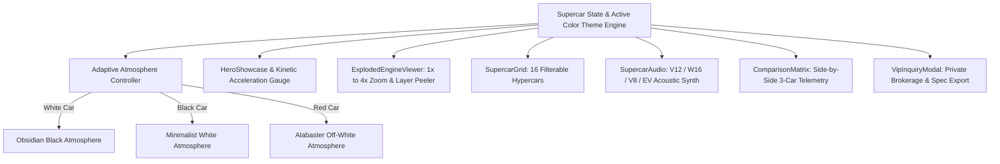

<div align="center">

# 🏎️ APEX HYPERCARS — Ultra-Luxury Supercar Showcase & 3D Exploded Engine X-Ray

[](https://github.com/Ishant6565)
[](LICENSE)
[](https://react.dev/)
[](https://www.typescriptlang.org/)
[](https://vitejs.dev/)
[](https://github.com/Ishant6565)

<br />

<p align="center">
  <strong>A commercial-grade, multi-million dollar Hypercar & Supercar Showcase platform engineered for luxury presentations and client acquisitions, featuring 16 world-record hypercars, an interactive 3D Exploded Engine / X-Ray Deconstruction Zoom View ($1\times$ to $4\times$), adaptive background lighting (White $\to$ Black BG, Black $\to$ White BG, Red $\to$ Off-White BG), procedural multi-architecture Web Audio acoustics, side-by-side comparison matrix, and VIP brokerage portal.</strong>
</p>

<p align="center">
  <a href="#-key-features">Key Features</a> •
  <a href="#-16-iconic-hypercars-lineup">Hypercar Lineup</a> •
  <a href="#-adaptive-background-lighting-engine">Adaptive Lighting</a> •
  <a href="#-exploded-engine-x-ray-viewer">Engine X-Ray</a> •
  <a href="#-quickstart">Quickstart</a> •
  <a href="#-author">Author</a>
</p>

</div>

---

## 🌟 Key Features

- 🔍 **Interactive 3D Exploded Engine / X-Ray Deconstruction ($1\times$ to $4\times$ Zoom)**:
  - Multi-layer peeling controls: *Carbon Body Skin $\to$ Active Aerodynamics $\to$ Monocoque Chassis $\to$ Powertrain Core $\to$ Titanium Inconel Exhaust $\to$ Carbon-Ceramic Brakes*.
  - Interactive pulsating Radar Hotspots on engine components displaying micro-engineering blueprints, material alloys, and thermal tolerances (up to 1,100°C).
  - X-Ray & Blueprint cybernetic visual filters.
- 🎨 **Adaptive Color Lighting Architecture**:
  - ⚪ **White Car Active** $\to$ Dynamic transition to **Deep Obsidian Black (`#000000`)** with crisp white highlights.
  - ⚫ **Black / Carbon Car Active** $\to$ Dynamic transition to **Luminous Minimalist White / Platinum (`#f4f4f6`)** with dark carbon contrast.
  - 🔴 **Rosso Red Car Active** $\to$ Dynamic transition to **Warm Museum Off-White / Alabaster Slate (`#f2efe9`)** with crimson red accents.
- 🔊 **Procedural Web Audio Multi-Engine Synthesizer**:
  - Screaming 12,000 RPM naturally aspirated Cosworth/GMA V12.
  - 8.0L Quad-Turbo W16 Bugatti roar with low-end bass rumble.
  - Flat-plane crank Twin-Turbo V8 bark (Koenigsegg/Hennessey).
  - Quad-Motor Formula-E / Hyper-EV whistle (Rimac Nevera).
- ⚖️ **Side-by-Side Hypercar Comparison Matrix**: Benchmark up to 3 hypercars simultaneously across 12 dimensions (0-100 km/h, Power-to-weight, Downforce at 250 km/h, Top Speed, Valuations).
- 💼 **Private Brokerage & VIP Client Acquisition Portal**:
  - Allocation inquiry form with instant certified technical spec sheet download (`.txt`).
  - Booking VIP private track days and bespoke vehicle consignments.
- 🏛️ **Luxury Monochrome & Carbon Aesthetic**: Glassmorphism, kinetic typography (Outfit & JetBrains Mono), smooth micro-interactions.

---

## 🏎️ 16 Iconic Hypercars Lineup

| # | Hypercar Model | Edition Finish | Powertrain | Power (HP) | 0-100 km/h | Top Speed | Valuation |
| :---: | :--- | :--- | :--- | :---: | :---: | :---: | :---: |
| 1 | **Bugatti Chiron 300+** | ⚪ Glacier Pearl | 8.0L Quad-Turbo W16 | **1,600 HP** | 2.3s | **490.48 km/h** | $4.10M |
| 2 | **Koenigsegg Jesko Absolut** | ⚪ Ghost White | 5.0L Twin-Turbo V8 | **1,600 HP** | 2.5s | **531.00 km/h** | $3.40M |
| 3 | **Pagani Utopia** | ⚪ Bianco Benny | 6.0L Biturbo AMG V12 | **864 HP** | 2.8s | **354.00 km/h** | $2.50M |
| 4 | **Porsche 918 Spyder** | ⚪ Weissach Pure | 4.6L V8 Hybrid | **887 HP** | 2.4s | **345.00 km/h** | $1.95M |
| 5 | **Gordon Murray T.50** | ⚪ Alabaster Fan | 3.9L Cosworth V12 | **663 HP** | 2.7s | **360.00 km/h** | $3.10M |
| 6 | **Rimac Nevera Attack** | ⚫ Obsidian Midnight | Quad-Motor EV | **1,914 HP** | 1.81s | **412.00 km/h** | $2.60M |
| 7 | **Koenigsegg Regera** | ⚫ Carbon Stealth | 5.0L V8 Hybrid Direct | **1,500 HP** | 2.8s | **404.00 km/h** | $2.20M |
| 8 | **Hennessey Venom F5** | ⚫ Dark Matter | 6.6L "Fury" Twin-Turbo | **1,817 HP** | 2.6s | **485.00 km/h** | $2.70M |
| 9 | **McLaren Speedtail** | ⚫ Onyx Streamline | 4.0L V8 Hybrid GT | **1,070 HP** | 3.0s | **403.00 km/h** | $2.25M |
| 10 | **Pagani Huayra R** | ⚫ Nero Track Weapon| 6.0L HWA V12-R | **850 HP** | 2.5s | **380.00 km/h** | $3.50M |
| 11 | **Ferrari SF90 XX** | 🔴 Rosso Corsa | 3.9L V8 Tri-Motor | **1,030 CV**| 2.3s | **320.00 km/h** | $0.89M |
| 12 | **Ferrari Daytona SP3**| 🔴 Rosso Magma | 6.5L Icona V12 | **840 CV** | 2.85s | **340.00 km/h** | $2.25M |
| 13 | **Lamborghini Revuelto**| 🔴 Rosso Efesto | 6.5L V12 HPEV Hybrid | **1,015 CV**| 2.5s | **350.00 km/h** | $0.61M |
| 14 | **Aston Martin Valkyrie**| 🔴 Crimson Hyper | 6.5L Cosworth F1 V12 | **1,160 HP**| 2.5s | **400.00 km/h** | $3.50M |
| 15 | **Mercedes-AMG ONE** | 🔴 Motorsport Red | 1.6L F1 Turbo V6 | **1,063 HP**| 2.9s | **352.00 km/h** | $2.75M |
| 16 | **SSC Tuatara Aggressor**| ⚫ Carbon Stealth | 5.9L NRE Flat-Plane V8 | **2,200 HP**| 2.5s | **475.00 km/h** | $2.40M |

---

## 🏗️ Architecture & Component Hierarchy



---

## 🚀 Quickstart Guide

### 1. Launch the Platform Locally
```bash
# Install dependencies
npm install

# Start Vite development server
npm run dev
```

Open `http://localhost:5173/` in your browser.

### 2. Interactive Navigation
- **Click any car in the gallery**: Switches active car & dynamically transitions the background lighting!
- **Click "EXPLODE & ZOOM ENGINE X-RAY"**: Opens the 3D deconstruction engine viewer.
- **Hold "HOLD TO REV"**: Revs the procedural engine sound synthesizer with authentic RPM acoustics!
- **Click "+ Compare"**: Adds hypercars to the side-by-side benchmark matrix.
- **Click "Private Brokerage"**: Opens the VIP client acquisition portal to download spec sheets.

---

## 👤 Author

Engineered with passion by **[Ishant6565](https://github.com/Ishant6565)**.

- **GitHub**: [@Ishant6565](https://github.com/Ishant6565)

---

## 📄 License

This project is licensed under the **MIT License**.
