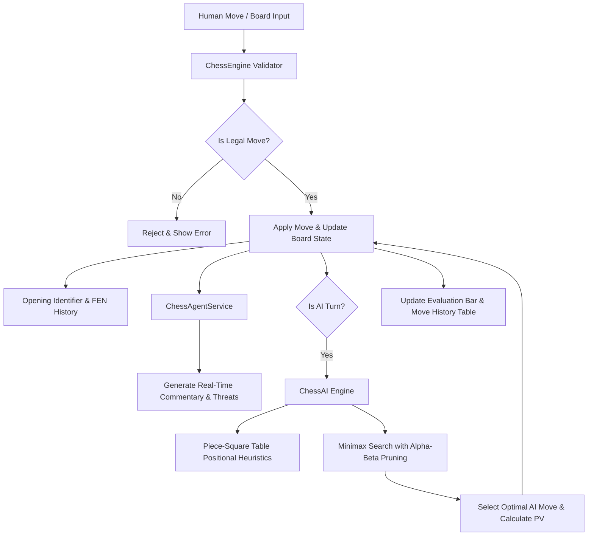

<div align="center">

# ♟️ CHESS-AI — Autonomous Multi-Level AI Chess Agent

[](https://github.com/Ishant6565)
[](https://github.com/Ishant6565/CHESS-AI)
[](LICENSE)
[](https://react.dev/)
[](https://www.typescriptlang.org/)
[](https://vitejs.dev/)
[](https://www.python.org/)

<br />

<p align="center">
  <strong>An autonomous multi-level AI Chess Playing Agent engineered with Minimax Alpha-Beta Pruning, Piece-Square Table (PST) Heuristics, Dynamic Evaluation, and Real-Time Agent Move Commentary.</strong>
</p>

<p align="center">
  <a href="#-key-features">Key Features</a> •
  <a href="#-ai-difficulty-levels">AI Levels</a> •
  <a href="#-system-architecture">Architecture</a> •
  <a href="#-quickstart-guide">Quickstart</a> •
  <a href="#-cli-agent-usage">CLI Agent</a> •
  <a href="#-author">Author</a>
</p>

</div>

---

## 🌟 Key Features

- ♟️ **Full Standard Chess Engine**: 100% pure TypeScript implementation supporting legal moves, castling (kingside/queenside), en-passant captures, pawn promotions, in-check alerts, checkmate, stalemate, and 3-fold repetition/50-move draws.
- 🧠 **Multi-Level Autonomous AI**: 4 adaptive difficulty tiers (Beginner Elo 800 to Grandmaster Elo 2800+) utilizing Minimax with Alpha-Beta pruning, MVV-LVA move ordering, and positional Piece-Square Tables (PST).
- 🎙️ **Live Agent Chain-of-Thought & Commentary**: Dynamic natural language breakdown of every move, tactical threat alerts, and strategic long-term plans.
- 📊 **Dynamic Real-Time Evaluation Bar**: Animated vertical meter computing balance of power in centipawns and mate sequences.
- 💡 **Interactive AI Coach**: "Ask Coach for a Hint" feature delivering tactical suggestions and positional explanations.
- 📖 **Opening Book Recognition**: Live identification of opening systems including Sicilian Defense, Ruy Lopez, Queen's Gambit, French Defense, Caro-Kann, and King's Indian.
- 🖤 **Luxury Minimalist Monochrome UI**: Clean, high-contrast black & white aesthetic with crisp SVG vector chess pieces and smooth glassmorphic controls.
- 🐍 **Standalone Python CLI Chess Agent**: Terminal ASCII chessboard with interactive play, depth tuning, and autonomous AI-vs-AI demo matches.

---

## 🎯 AI Difficulty Levels

| Level | Title | Target Elo | Search Depth | Blunder Chance | Heuristic Profile |
| :--- | :--- | :---: | :---: | :---: | :--- |
| 🥉 **Beginner** | *Novice Bot* | **~800** | Depth 2 | 25% | Casual play, basic material counting, friendly coaching advice. |
| 🥈 **Intermediate** | *Club Master* | **~1500** | Depth 3 | 5% | Central control, active piece development, tactical fork awareness. |
| 🥇 **Master** | *Tactical Engine* | **~2200** | Depth 4 | 0% | Minimax + Alpha-Beta pruning, king safety, pawn structure evaluation. |
| 👑 **Grandmaster** | *Autonomous GM Agent* | **~2800+** | Depth 5+ | 0% | Deep tactical calculation, transposition tables, multi-turn strategic foresight. |

---

## 🏗️ System Architecture



---

## 🚀 Quickstart Guide

### 1. Clone the Repository
```bash
git clone https://github.com/Ishant6565/CHESS-AI.git
cd CHESS-AI
```

### 2. Launch the Interactive Web Application
```bash
# Install NPM dependencies
npm install

# Start the Vite development server
npm run dev
```

Open your browser at `http://localhost:5173` to play against the autonomous agent!

---

## 🐍 CLI Agent Usage

You can also challenge the AI directly in your terminal using the standalone Python agent:

```bash
# Install Python dependencies
pip install -r requirements.txt

# Play as White against Intermediate AI
python chess_agent.py --level intermediate --color white

# Play as Black against Master AI
python chess_agent.py --level master --color black

# Run an Autonomous AI vs AI Demonstration
python chess_agent.py --level grandmaster --demo
```

---

## 📂 Project Structure

```
CHESS/
├── src/
│   ├── chess/
│   │   ├── types.ts           # Chess types, moves, game state interfaces
│   │   ├── engine.ts          # Core chess rule validator & FEN/SAN generator
│   │   ├── ai.ts              # Minimax Alpha-Beta search & PST heuristics
│   │   └── openings.ts        # ECO opening book database & matcher
│   ├── services/
│   │   └── chessAgent.ts      # Real-time move commentary & coach hint service
│   ├── components/
│   │   ├── ChessBoard.tsx     # 8x8 luxury monochrome interactive board
│   │   ├── ChessPieces.tsx    # Crisp SVG vector piece graphics
│   │   ├── EvaluationBar.tsx  # Dynamic vertical evaluation meter
│   │   ├── AgentHud.tsx       # Agent intelligence HUD & thought terminal
│   │   ├── MoveHistory.tsx    # Notation table & PGN/FEN exporter
│   │   ├── GameReviewModal.tsx# Post-game accuracy & performance review
│   │   ├── SettingsModal.tsx  # Board & engine preference controls
│   │   └── Navbar.tsx         # Top navigation & Ishant6565 branding
│   ├── App.tsx                # Main application coordinator
│   └── index.css              # Monochrome theme & glassmorphism utilities
├── chess_agent.py             # Standalone Python CLI Chess Agent
├── requirements.txt           # Python dependencies
├── package.json               # NPM package metadata
└── README.md                  # Documentation & badges
```

---

## 👤 Author

Crafted with dedication by **[Ishant6565](https://github.com/Ishant6565)**.

- **GitHub**: [@Ishant6565](https://github.com/Ishant6565)
- **Repository**: [Ishant6565/CHESS-AI](https://github.com/Ishant6565/CHESS-AI)

---

## 📄 License

This project is licensed under the **MIT License**. Feel free to use, modify, and distribute for educational and commercial purposes.
